# KubeRay History Server Benchmark

End-to-end sizing measurements for the [KubeRay](https://github.com/ray-project/kuberay)
History Server data path — Ray event aggregator → `collector` sidecar → object
storage → History Server — running a real Ray job on a real cluster, from 1,000
to 100,000 tasks in a single session.

Every number below comes from a run in [`results/`](results/);
[`results/derived.csv`](results/derived.csv) flattens all 60 of them, and the
harness that produced them is in [`benchmark/`](benchmark/). The charts read
that CSV for the size sweeps, but the control-experiment values (CPU curve,
GOMAXPROCS/GOGC cells, flush split) are transcribed into
[`tools/gen_charts.py`](tools/gen_charts.py) by hand — check them against the
CSV rather than assuming they regenerate.

```
events   E ≈ N × 4.36              1 definition + 2.36 lifecycle + 1 profile per task
storage  S ≈ N × 3.15 KiB          raw   →   N × 0.29 KiB with gzip (91% smaller)
HS load  T ≈ N × 0.6 ms            at 2+ cores   →   N × 1.5 ms at the shipped 500m
                                   linear at both, measured from 1k to 200k tasks
HS RSS   M ≈ 400 MiB + N × 20 KiB  per session held in the snapshot cache
                                   (100k ≈ 2.2 GiB, 200k ≈ 2.9 GiB measured)
opens?   N < timeout / per-task    ~79k tasks at 500m, ~200k at 2+ cores — past that
                                   the load is aborted and retried forever
```

> **The single most valuable thing in this repo:** KubeRay's sample History
> Server manifest caps the container at `500m` CPU, and the cold load saturates
> it for its entire duration against ~1.2 cores of demand. That costs **2.5×**
> (1.5 ms/task versus 0.6), and — because the server aborts any load that exceeds
> `--session-process-timeout` and every retry starts over — it drops the largest
> openable session from ~200,000 tasks to **~79,000**. Past that line a session
> is not slow, it is **unopenable**. Two lines of YAML fix both.

`N` = tasks in one Ray session. Ray actor calls emit task events too, so count them in `N`.

---

## Change these two things first

**1. Give the History Server real CPU.** `historyserver/config/historyserver.yaml`
sets only `limits.cpu: "500m"`, so Kubernetes pins `requests.cpu` there too, and
the cold load saturates it — 0.42–0.50 cores for the entire load, in every run.

```yaml
resources:
  requests:
    cpu: "500m"
  limits:
    cpu: "4"      # was "500m"
```

50k tasks: **85 s → 32 s**; 100k: **151 s → 68 s**. Returns diminish sharply
around 1.5–2 cores: every configuration at or above 2 overlaps within the
run-to-run spread we measured (two runs at 2 cores differed by 10.7 s), and
removing the limit entirely is no faster than 4. The load only wants ~1.2 cores.
Most points on that curve are single runs, so read it as "diminishing returns
near 2" rather than a precise plateau.

The 100k number at `500m` took a raised `--session-process-timeout` to measure at
all. With the shipped 2-minute default that load is aborted at 120 s, the partial
state is discarded, and every retry starts over, so it never returns. Earlier
versions of this report mistook that for a 907-second load and called it
superlinear. It is neither: **cost per task is flat at both CPU limits** —
1.51–1.53 ms at `500m`, 0.60–0.72 ms at 2–4 cores, measured from 1k to 200k
tasks.

**2. Turn compression on.** `RAY_COLLECTOR_EVENT_COMPRESSION_ENABLED=true` on the
collector sidecars cuts stored bytes by **91%** (3.15 KiB → 0.29 KiB per task)
with no measurable CPU or load-time cost. It is off by default.

Everything else worth configuring is in [docs/SIZING.md](docs/SIZING.md).
Compression is not quite free — it costs 16–25% of cold-load time, measured from
one compressed run against three uncompressed ones — but storage is usually the
scarcer resource.

### And one that needs a code change

Every cold load writes one INFO line per event (`eventserver.go:136`, called from
the per-event loop at `:1164`) — 436,000 lines for a 100k-task session, with no
log-level flag to turn them off:

```go
logrus.Debugf("current eventType: %v", eventType)   // was Infof
```

Worth 13% at 50k (97.9 s → 85.3 s). Note it does **not** fix the 100k case — that
was the CPU limit, as the charts below show.

---

## Storage

<picture><source media="(prefers-color-scheme: dark)" srcset="docs/img/storage-per-task-dark.svg">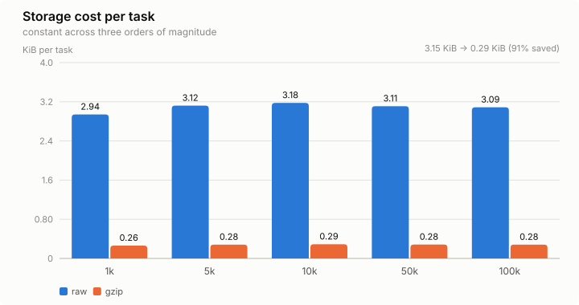</picture>

Compression saves **91%** (ratio 0.089–0.091 across three orders of magnitude —
event JSONL is highly repetitive at every scale), and it is **off by default**.

It is not free, though. One 100k session took **78.6 s to load compressed**
against **62.7, 64.8 and 67.9 s** for uncompressed runs of the same size — 16%
to 25% slower depending which control you compare against, from a single
compressed run. An earlier version of this report called the cost unmeasurable,
which was an artifact of measuring it while the server was CPU-starved and
everything was slow. Collector-side CPU per event is genuinely unchanged
(118–125 µs vs 115–124 µs); the cost lands on the read path.

<picture><source media="(prefers-color-scheme: dark)" srcset="docs/img/storage-dark.svg">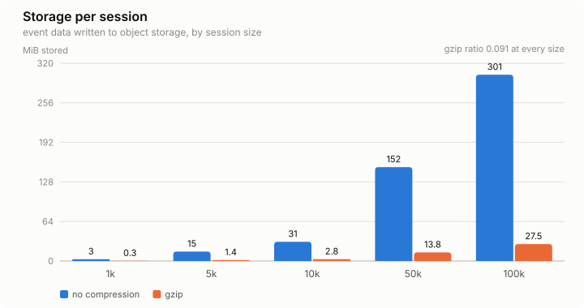</picture>

<picture><source media="(prefers-color-scheme: dark)" srcset="docs/img/flush-split-dark.svg">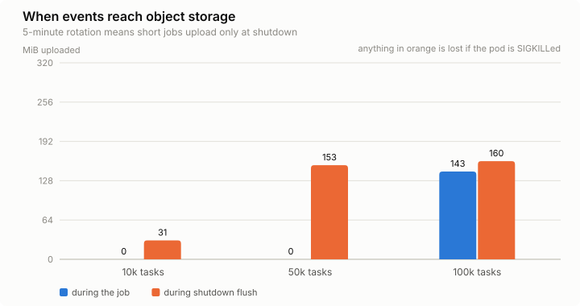</picture>

With the default 5-minute rotation interval, **a job shorter than 5 minutes
uploads nothing until its pod terminates gracefully.** Everything in orange would
be lost to a SIGKILL — along with the session marker written during the same
drain, without which the session never appears in the UI at all.

## History Server

<picture><source media="(prefers-color-scheme: dark)" srcset="docs/img/hs-cpu-limit-dark.svg">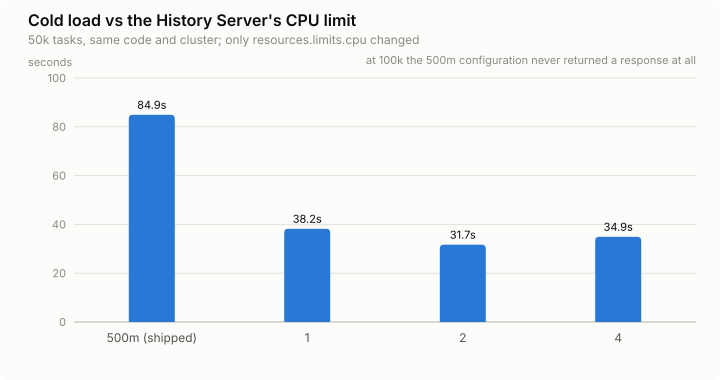</picture>

Cold load is `GET /enter_cluster` — the first time anyone opens a dead session,
and where all of the History Server's cost lives (process start does zero
storage I/O). Same build, same cluster, same workload definition and the only
configuration difference is `resources.limits.cpu` — but each run generated its
own session, so object layout and event counts differ slightly between cells.
Comparing HS variants against one immutable stored session is the single
biggest improvement this benchmark still needs.

<picture><source media="(prefers-color-scheme: dark)" srcset="docs/img/hs-load-knee-dark.svg">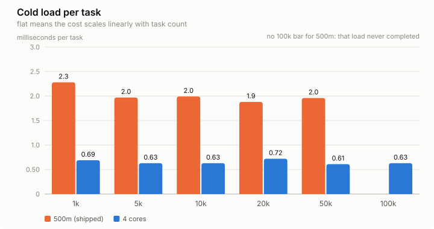</picture>

There is no blowup and no knee. Cost per task is constant at both limits; the
limit only sets which constant. What looked like a cliff was the server-side
timeout aborting the load and the retry loop never converging.

Two effects could be bundled here, and we separated them. The History Server is
a Go 1.26 binary, and since Go 1.25 the runtime takes `GOMAXPROCS` from the
cgroup CPU **limit**, never the request — rounded up, with a floor of 2. So
`500m` also means `GOMAXPROCS = 2`. Controls: forcing `GOMAXPROCS=4` while
holding the limit at `500m` changes nothing (85.3 s → 84.7 s), and raising the
limit to 4 with `GOMAXPROCS` pinned to 1 still loads 100k in 76.3 s. **The CFS
quota is the binding constraint; Go parallelism is worth about 1.2×.** Measured
GC share backs this up: 8% of CPU at `500m`, 1–2% at 4 cores.

<picture><source media="(prefers-color-scheme: dark)" srcset="docs/img/hs-load-dark.svg">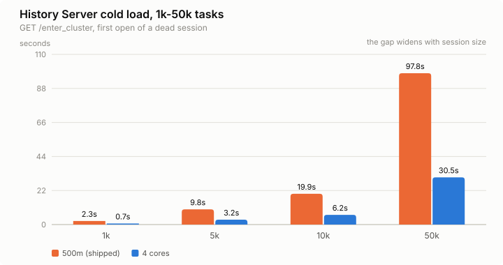</picture>

On log-log axes a straight line means the cost scales linearly with task count,
and both configurations are straight — they differ only in the constant.

Read the orange series carefully. The **dashed** part is the same `500m` limit
measured on an earlier build that still logged once per event, so those four
points sit about 25% high (1.8–2.3 ms/task) relative to the solid pair
(1.51–1.53 ms/task). They are drawn separately rather than joined, because a
line through both would attribute a build difference to scaling.

The 100k and 200k points also needed `--session-process-timeout` raised to be
measurable at all: under the 2-minute default those loads are aborted and every
retry starts over. One caveat on the 200k point — that run stored 187,743 of
200,000 task definitions, so its 0.60 ms/task is 0.64 if you divide by what was
actually stored.

Two other things sit on this path regardless of CPU: a hardcoded 35 s HTTP
`WriteTimeout` that is *shorter* than the 2-minute load timeout it should
outlive, and ~436,000 INFO log lines per 100k-task load (removing them bought
13%). See [docs/FINDINGS.md](docs/FINDINGS.md).

### Was it the CPU quota, or Go's parallelism?

The History Server is a Go 1.26 binary, and since Go 1.25 the runtime derives
`GOMAXPROCS` from the cgroup CPU **limit** — never from `requests` — rounding up
but [never below 2](https://pkg.go.dev/runtime#GOMAXPROCS). So changing the limit
changes two things at once: the CFS quota, and how many threads Go will run.
`500m` yields `GOMAXPROCS=2`, `4` yields 4, and no limit at all yields the node's
core count. Its own `GODEBUG=gctrace=1` output confirms each value.

Forcing `GOMAXPROCS` separates them:

<picture><source media="(prefers-color-scheme: dark)" srcset="docs/img/hs-quota-vs-parallelism-dark.svg">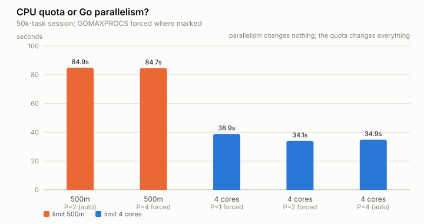</picture>

**The quota is what matters.** Holding the limit at `500m` and forcing four `P`s
changes nothing (84.7 s against 84.9 s). Raising the limit to 4 while pinning
`GOMAXPROCS=1` still gets 50k down to 38.9 s. Parallelism is worth something —
38.9 s at one `P` against 34.1 s at two — but it is a 12% effect sitting on top
of a 2.5× one.

Nothing we tried beat what the runtime picks for itself, at `limits.cpu: 2` and
100k tasks:

| Override | Cold load | GC share | Peak Go heap |
|---|---:|---:|---:|
| none (`GOMAXPROCS`=2, `GOGC`=100) | 64.4 s | 5% | ~1.2 GB |
| `GOMAXPROCS=4` | 64.6 s | 3% | 1.3 GB |
| `GOMAXPROCS=8` | 72.2 s | 2% | 1.4 GB |
| `GOGC=200` | 65.9 s | 2% | 2.0 GB |
| `GOGC=400` | 70.8 s | 1% | 3.1 GB |

Those latency gaps are the same size as the run-to-run spread, so treat the
ordering as preliminary — but nothing helped, and `GOGC` is unambiguously a bad
trade here: it does exactly what it promises, cutting GC share from 5% to 1%,
while tripling the heap to buy down a cost that was never the bottleneck. GC
never was: at `500m` it accounts for 8% of CPU, and setting `GOGC=400` there
dropped it to 1% while the load still never completed.

**Set the CPU limit and leave the Go runtime alone.**

<picture><source media="(prefers-color-scheme: dark)" srcset="docs/img/hs-memory-dark.svg">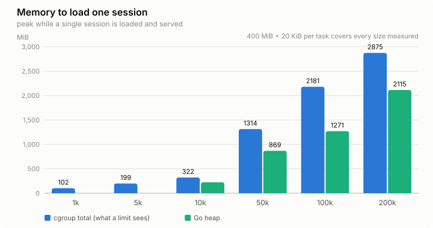</picture>

Loading one session costs about **400 MiB + 20 KiB per task** of container
memory — 1.3 GiB at 50k tasks, 2.2 GiB at 100k, 2.9 GiB at 200k — and the
snapshot stays in an LRU of up to 100 sessions with no TTL by default, so budget
for every session a user might open, not for one. Per-task cost falls as
sessions grow because a ~90 MiB floor is amortized; the table with Go heap,
anonymous memory and cgroup total side by side is in
[docs/RESULTS.md](docs/RESULTS.md).

Note this model counts **tasks only**. In the 50k session, task-series events
outnumbered every other event type combined by 218,200 to 14, so node, job and
actor-lifecycle events are simply dropped from the arithmetic.

> **Every load time above was measured under a 500m CPU limit** — the value
> `historyserver/config/historyserver.yaml` ships. The container sat at
> 0.42–0.50 cores for the whole load in all thirteen runs, i.e. saturated.
> Raising that limit is the first thing to try, and costs nothing but YAML.

## Collector sidecar

<picture><source media="(prefers-color-scheme: dark)" srcset="docs/img/collector-cpu-dark.svg">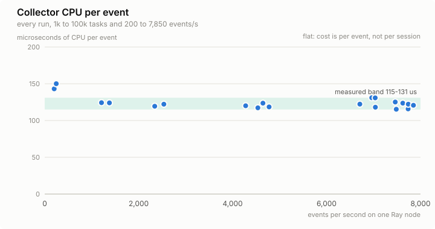</picture>

The most portable result here: **≈120 µs of CPU per event ≈ 0.52 ms per task**,
unchanged across three orders of magnitude of session size and a 40× range of
event rate. Size the collector from the *rate* on its node, never from the job's
total size.

<picture><source media="(prefers-color-scheme: dark)" srcset="docs/img/collector-memory-dark.svg">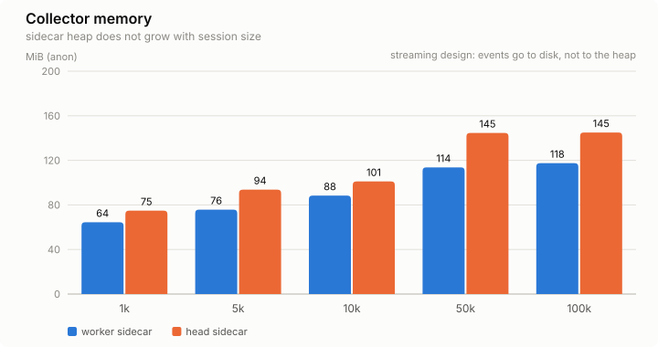</picture>

Memory does not grow with session size because the collector streams to disk
and uploads in the background — events never accumulate in it. Note this is
*anonymous memory* from cgroup accounting, not Go heap: where we have both
numbers, anonymous memory overstates the Go heap by roughly 20%.

We cannot say backpressure never engaged. The collector's 503 path writes an
HTTP response without logging anything, and our counter searched the logs, so it
reports zero whether or not any 503 happened. That instrumentation gap is a
finding, not a result.

**Size the head's collector like a worker's.** The head ran `num-cpus: "0"` — not
a single task executed there — and it still produced **54% of all events**, because
the driver that *owns* every task lives there. Owner-side events (all 50,005
`TASK_DEFINITION`s plus 68,117 of the 118,149 `TASK_LIFECYCLE`s) do not care where
the task ran.

<picture><source media="(prefers-color-scheme: dark)" srcset="docs/img/rate-vs-concurrency-dark.svg">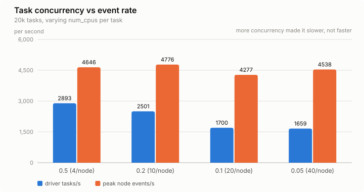</picture>

Raising task concurrency 10× did **not** raise the event rate — for small tasks
the driver's submission loop is the bottleneck, and 40 Python workers per node
cost more than they add. You cannot infer collector load from `num_cpus` or
replica count; only from tasks/s per node.

---

## Sizing everything else

| | Recommendation | Why |
|---|---|---|
| Collector CPU | `requests: R × 0.52 millicores`, `limits:` 3× that (R = sustained tasks/s **per node**) | 120 µs/event × 4.36 events/task; bursts run 2–4× the sustained average |
| Collector memory | `requests: 128Mi`, `limits: 512Mi` | heap is flat at ~120 MiB; cgroup total incl. page cache hits 251 MiB |
| History Server memory | `100 MiB + 23 KiB × N × sessions cached` | snapshots are retained in the LRU |
| `--session-process-timeout` | `N × 0.62 ms × 2` | with adequate CPU the 2-minute default already covers ~190k tasks |
| Session size | under ~56k tasks, until `WriteTimeout` is configurable | a load over 35 s cannot deliver any response to an HTTP/1 client |

Full derivation and worked examples: **[docs/SIZING.md](docs/SIZING.md)**.

## Documentation

| Doc | Contents |
|---|---|
| [docs/SIZING.md](docs/SIZING.md) | Decide your own resource requests — formulas, tables, checklist |
| [docs/RESULTS.md](docs/RESULTS.md) | Every measurement with the numbers behind these charts |
| [docs/FINDINGS.md](docs/FINDINGS.md) | Bugs and design limits found, with source references |
| [docs/DIMENSIONS.md](docs/DIMENSIONS.md) | The data path and what each axis varied |
| [docs/ENVIRONMENT.md](docs/ENVIRONMENT.md) | Hardware, versions, image digests |
| [benchmark/README.md](benchmark/README.md) | Harness internals and every knob |

## Reproduce

The harness is a Go test that lives inside a KubeRay checkout (it reuses the
History Server e2e support package):

```bash
git clone https://github.com/ray-project/kuberay.git
./benchmark/install.sh /path/to/kuberay
cd /path/to/kuberay/historyserver/test/benchmark
./run_matrix.sh          # dedicated kind cluster, 14 runs, ~2.5h
```

One point instead of the matrix:

```bash
cd /path/to/kuberay/historyserver
BENCH_RUN=1 BENCH_TASK_COUNT=10000 go test ./test/benchmark -run TestHistoryServerBenchmark -v -timeout 90m
```

Regenerate the table and charts from whatever is in `results/`:

```bash
python3 tools/derive.py results > results/derived.csv
python3 tools/gen_charts.py results/derived.csv docs/img
```

## Scope and honesty notes

- Measured on **kind on macOS** (Docker Desktop VM). Byte counts, event counts,
  ratios and scaling shapes port anywhere; absolute CPU seconds do not.
- Tasks are no-ops. Real tasks emit the same event counts but write more logs;
  the `logs/` category here is only ~45 B/task.
- One head + one worker node. Per-node numbers generalize; cluster totals are a
  sum over nodes, not a measured scale-out.
- Several numbers in `results/` are not measurements and are labelled as such:
  `A-n1000` (flush race in an early harness version — the fixed rerun is
  `rerun-A-n1000`), every run marked `collector_log_capture=no`, every
  `enterMeasured: false` run (the client never got a 200, so the elapsed time is
  the probe budget), and all `collector_503s` values (the 503 path emits no log
  line for the counter to find).
- Earlier versions of this report quoted 907 s as a 100k cold-load time. That was
  elapsed probe time on a load that never returned. It has been removed
  everywhere; the honest statement is that the configuration did not complete.

## License

Apache 2.0, matching KubeRay. The harness derives from KubeRay's e2e test support code.
