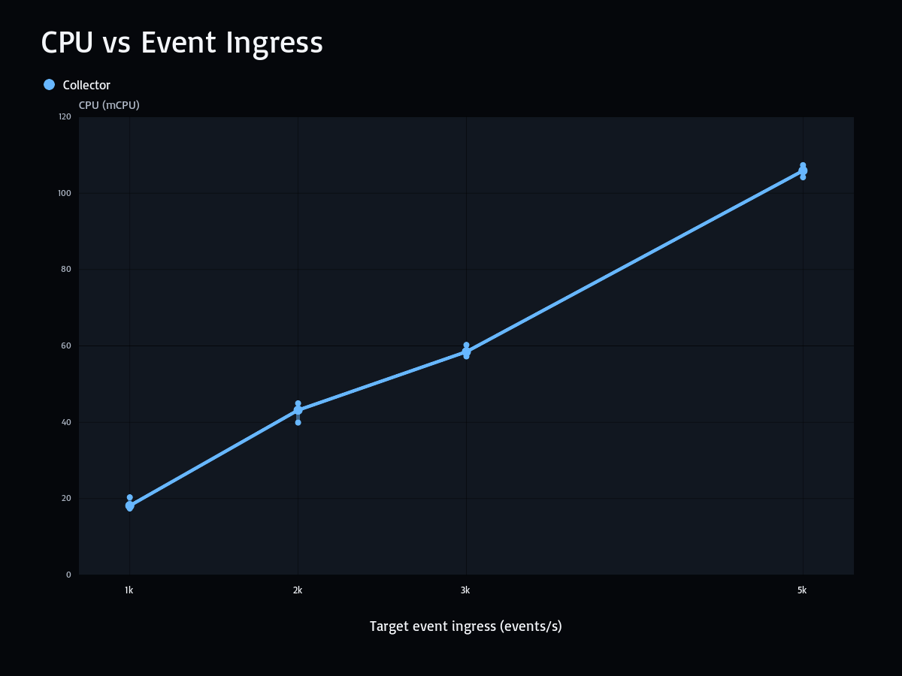
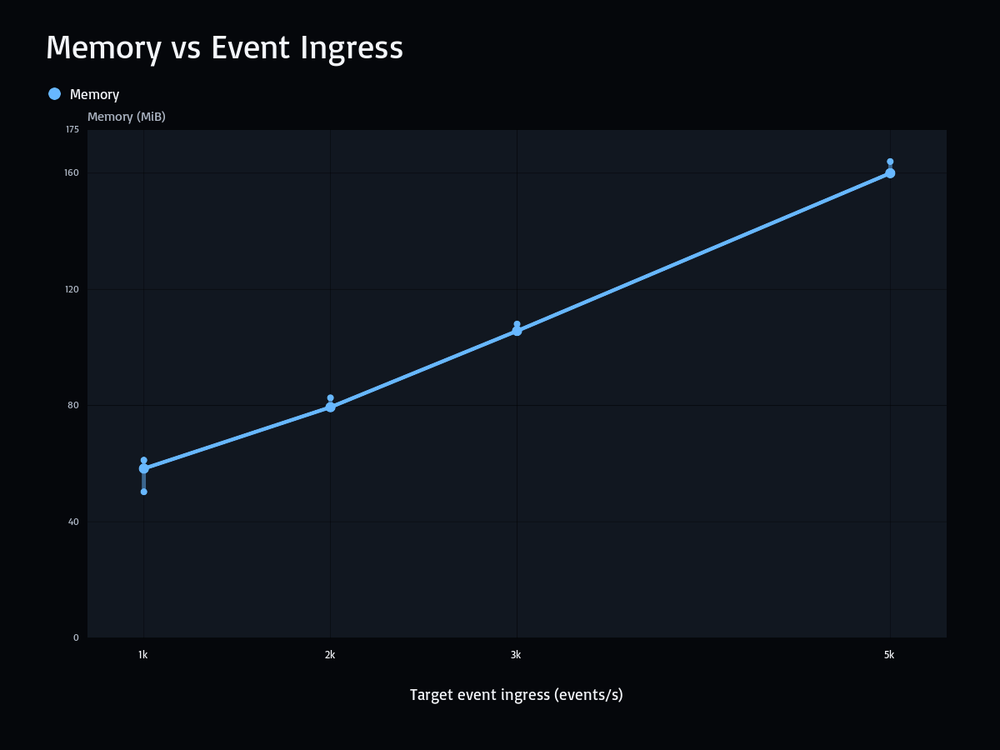
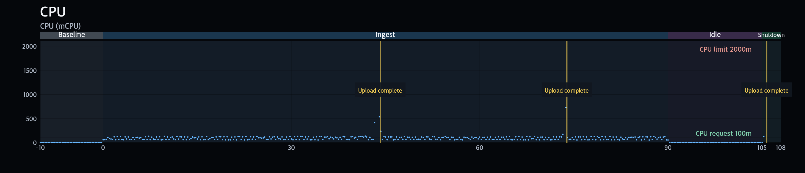
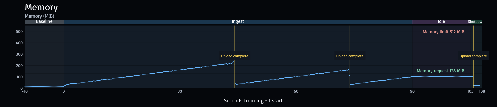
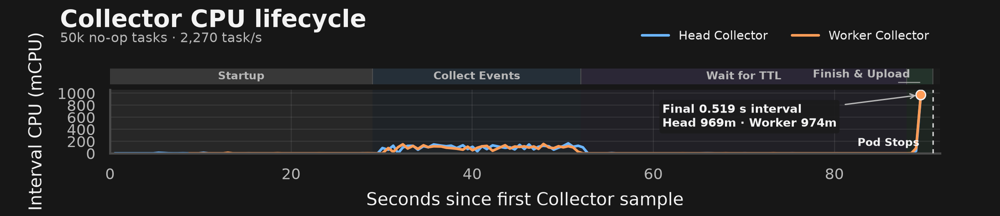
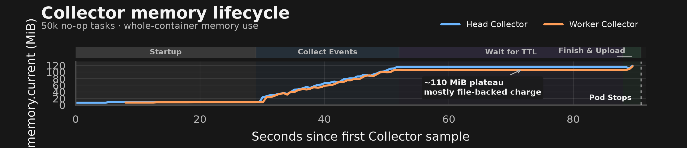
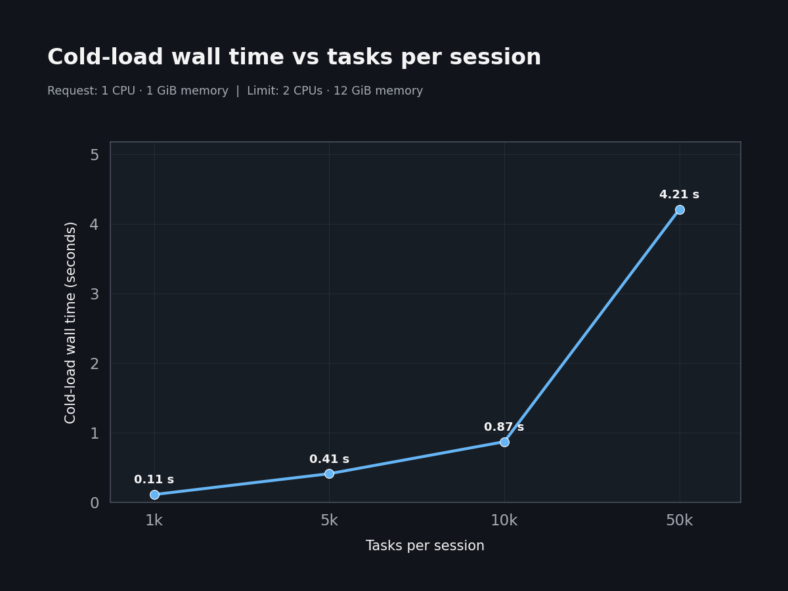
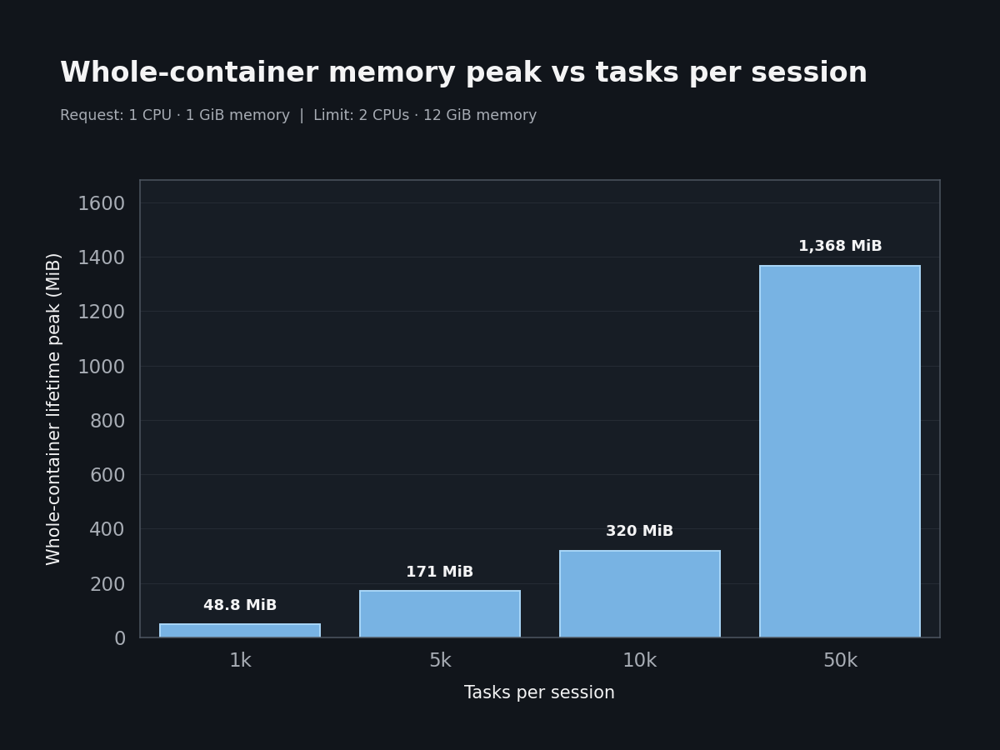
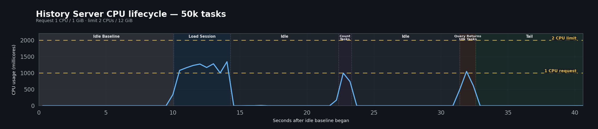
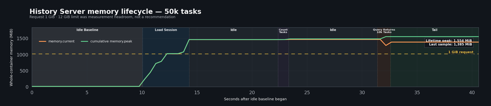

# Ray History Server — Benchmark Evidence

Measurements behind **"Ray History Server: Bridging the Impossible Gaps in Observability"** (Ray Summit 2026, slides 16–22).

The talk says two components need two different sizing rules. This repository is the evidence for that. It has every chart on the slides, the numbers each chart was drawn from, and the code to run it all again.

Everything you need to read is on this page. [`benchmark/`](benchmark) holds the charts, the data, and the reproduce code.

**Who this is for.** You are deciding how much CPU and memory to give these two components in Kubernetes. This page tells you what they actually cost, and where the numbers stop being true.

---

## Contents

- [The short version](#the-short-version)
- [A few terms, in plain language](#a-few-terms-in-plain-language)
- [How things were measured](#how-things-were-measured)
- [Part 1 — Collector](#part-1--collector)
  - [CPU tracks events per second](#cpu-tracks-events-per-second)
  - [Memory is disk cache, not the program](#memory-is-disk-cache-not-the-program)
  - [One 90-second run, second by second](#one-90-second-run-second-by-second)
  - [How small can the memory limit go?](#how-small-can-the-memory-limit-go)
  - [Head Collector vs Worker Collector](#head-collector-vs-worker-collector)
  - [How many events does one task produce?](#how-many-events-does-one-task-produce)
- [Part 2 — History Server](#part-2--history-server)
  - [Load time is a straight line](#load-time-is-a-straight-line)
  - [Memory is a straight line too](#memory-is-a-straight-line-too)
  - [One 50k session, second by second](#one-50k-session-second-by-second)
- [Turning this into requests and limits](#turning-this-into-requests-and-limits)
- [What this does not prove](#what-this-does-not-prove)
- [Reproducing the campaigns](#reproducing-the-campaigns)
- [Repository layout](#repository-layout)

---

## The short version

| | Collector (one per Ray node) | History Server (one service) |
|---|---|---|
| **What it does** | catches events from a Ray node, writes them to local disk, ships them to object storage | loads a finished session back from storage so people can look at it |
| **What drives CPU** | how many events per second arrive | one-off bursts: opening a session, answering a query |
| **CPU cost** | about 20 mCPU per 1,000 events/s | 4.98 CPU-seconds to open a 50,000-task session |
| **What drives memory** | how many bytes are still waiting on local disk | how many tasks are in the session you opened |
| **Memory cost** | mostly disk cache the kernel can throw away; the program itself stays at ~21–26 MiB no matter what | about 27 KiB per task, on top of a ~37 MiB floor |
| **The question to ask** | "how much data piles up between uploads?" | "how big is the biggest session anyone will open?" |

Three findings worth knowing before the charts:

**1. The Collector's memory number is not the Collector.**
At 5,000 events/s the container showed ~160 MiB. Only ~25 MiB of that was the program. The other ~128 MiB was Linux keeping a copy of the on-disk file in RAM so it would not have to re-read it. Shrink the limit and the kernel just drops that copy. The program does not crash — it reads from disk a bit more.

**2. The History Server is boringly predictable.**
Load time fits a straight line: `84 microseconds × number of tasks`. Across a 50× range of session sizes, that line never bends. No cliff, no surprise.

**3. Every memory number here counts the whole container, not just the program.**
That includes the disk cache from finding 1. This is deliberate — it is exactly what Kubernetes counts against your `limits.memory`, so it is the number that can get you OOM-killed.

---

## A few terms, in plain language

You can read the whole page with just these:

| Term | What it means here |
|---|---|
| **mCPU** | thousandths of a CPU core. `100m` = 10% of one core. |
| **MiB / GiB** | megabytes / gigabytes, the binary kind. 1 GiB = 1,024 MiB. |
| **request vs limit** | in Kubernetes, the *request* is what you reserve (it decides where the Pod is scheduled). The *limit* is the hard ceiling. Going over the CPU limit gets you slowed down; going over the memory limit gets you killed. |
| **heap / "anon" memory** | memory the program allocated for itself. This is the part that really belongs to the process. |
| **page cache / "file" memory** | a copy of a disk file that Linux keeps in RAM to avoid re-reading the disk. It counts against your memory limit, but the kernel can throw it away at any time. |
| **peak** | the highest the container ever reached during a run. Not an average. This is what can kill you. |
| **p95 / p99** | the value that 95% (or 99%) of samples came in under. A way to describe "bad but not freak" cases. |
| **median (of n=3 / n=5)** | each test was run 3 or 5 times in fresh Pods. The median is the middle result; ranges show the best and worst. |
| **R²** | how well a straight line fits the data. 1.0 is a perfect line. Anything above 0.99 means "you can trust the formula". |
| **spool** | the file on the Collector's local disk where events pile up before being uploaded. |
| **cold load** | opening a session for the first time, with nothing cached. The slow path. |
| **OOM kill** | Kubernetes killing the container for going over its memory limit. |

---

## How things were measured

| | Collector campaign | History Server campaign |
|---|---|---|
| Workload | event generator at a fixed rate, 90 seconds of traffic | one pre-built session, opened and queried |
| Sizes tested | 1,000 / 2,000 / 3,000 / 5,000 events per second | 1,000 / 5,000 / 10,000 / 50,000 tasks |
| Repeats | 3 fresh Pods per size | 5 fresh Pods per size |
| Event size | 895 bytes per event (exact, across the whole campaign) | — |
| Pod settings | CPU request 100m, limit 2000m; memory limit varies by test | CPU request 1 / limit 2; memory request 1Gi / limit 12Gi |
| Go runtime | — | `GOMAXPROCS=2` (pinned on purpose — see the caveat below) |
| How memory was read | Linux cgroup v2 counters, split into program / disk-cache / kernel | same |
| How CPU was read | Linux cgroup v2 CPU counter, differenced against wall-clock time | same |

Everything ran on a dedicated test cluster, one fresh Pod per test, nothing else running beside it.

**Why the History Server numbers can be attributed to a single request.** Between each request the test waits for the container to go quiet — at least three consecutive measurement intervals below 50 mCPU — before sending the next one. If it does not go quiet within 30 seconds, the test fails rather than sending the next request anyway. So the "4.98 CPU-seconds to load a session" figure really is the load, not leftover work from something else.

**The Collector campaign's books balance exactly.** Across all 27 test runs:

| Events planned | Events sent | Events accepted | Distinct events found in storage |
|---:|---:|---:|---:|
| 7,650,000 | 7,650,000 | 7,650,000 | 7,650,000 |

6,846,750,000 bytes written, uploaded, and confirmed — exactly 895.0 bytes per event. After compression: 631,147,412 bytes stored, a **10.85 : 1** saving. Zero duplicates, zero corrupt lines, zero failed requests, zero retries, zero restarts, zero OOM kills, zero dropped events. Nothing was estimated or interpolated.

---

## Part 1 — Collector

The Collector is a small helper container that sits next to each Ray node. It receives events over HTTP, appends them to a file on local disk, and every so often compresses that file, uploads it to object storage, and deletes the local copy.

That shape explains everything below: **CPU is paid per event; memory is paid per byte still sitting on local disk.**

### CPU tracks events per second



One Collector, 90 seconds of steady traffic. The dot is the median of 3 runs; the whiskers are the best and worst run.

| Events per second | Average CPU while ingesting | Range (3 runs) | p95 | Highest single interval |
|---:|---:|---:|---:|---:|
| 1,000 | 18.1 mCPU | 17.4 – 20.3 | 65.2 mCPU | 748 mCPU |
| 5,000 | 105.9 mCPU | 104.2 – 107.3 | 134.1 mCPU | 1,110 mCPU |

> The chart plots four rates. The published data files carry the detailed per-run CPU statistics for 1,000 and 5,000 events/s. The rate below is confirmed independently at five more rates by the [head/worker campaign](#head-collector-vs-worker-collector).

**The rule: about 20 mCPU per 1,000 events per second.**
105.9 mCPU ÷ 5,000 = 21.2 mCPU per 1,000 events/s. A completely separate campaign, on a different workload and a different day, got 21.3 – 23.6. Across both campaigns, all seven measured points land between **18 and 24**. Two independent experiments landing in that narrow a band is why you can plan with this number.

**But do not size on the average.** The busiest single interval hit 748 mCPU at 1,000 events/s and 1,110 mCPU at 5,000 — **41× and 10× the average**. Those spikes are not ingest. They are the compress-and-upload burst. Nothing got throttled here because the limit was 2,000m. A limit set to "average plus a bit" would have throttled the Collector at the exact moment it was trying to flush its data out.

### Memory is disk cache, not the program



Container memory at exactly 30 seconds into the run. That moment was chosen because no upload has happened yet at any rate, so all four rates are compared at the same point in the cycle.

| Events per second | Container memory | Range (3 runs) | The program itself | Disk cache | Bytes on disk |
|---:|---:|---:|---:|---:|---:|
| 1,000 | 58.3 MiB | 50.3 – 61.2 | 25.0 MiB | 25.6 MiB | 25.6 MiB |
| 2,000 | 79.4 MiB | 79.3 – 82.7 | 21.3 MiB | 51.2 MiB | 51.2 MiB |
| 3,000 | 105.7 MiB | 105.1 – 108.1 | 22.9 MiB | 76.7 MiB | 76.8 MiB |
| 5,000 | 160.0 MiB | 159.7 – 164.0 | 24.5 MiB | 127.8 MiB | 127.8 MiB |

Read the last three columns across, not down.

**The program's own memory does not grow at all.** It sits between 21 and 25 MiB whether the Collector is handling 1,000 or 5,000 events per second. Every extra MiB in the first column is disk cache — and disk cache matches the file on disk to within 0.1 MiB at every rate.

In plain terms: the container's memory number is answering a *storage* question, not a *software* question. It is telling you how much data has piled up since the last upload.

**Peak memory does not simply follow the rate.** It follows how much data was waiting when the peak happened:

| Events per second | Written in 90 s | Uploads (when they happened) | Peak, median (range) | Memory at the end |
|---:|---:|---|---:|---:|
| 1,000 | 76.8 MiB | at shutdown only, 105.7 s | 119.3 MiB (113.5 – 122.5) | 28.9 MiB |
| 2,000 | 153.6 MiB | 72.9 s, then shutdown at 105.4 s | 171.9 MiB (171.2 – 175.3) | 27.0 MiB |
| 3,000 | 230.5 MiB | 43.8 s, then 103.8 s | 167.3 MiB (162.7 – 167.8) | 26.3 MiB |
| 5,000 | 384.1 MiB | 44.1 s, 73.9 s, then shutdown at 105.7 s | 245.0 MiB (236.4 – 247.2) | 21.4 MiB |

Look at 3,000 events/s: it peaked *lower* than 2,000 events/s. It uploaded earlier (43.8 s instead of 72.9 s), so there was less data sitting around when the peak was taken. **The thing to size for is not the rate. It is the largest pile of un-uploaded data the Collector ever holds.**

**The 1,000 events/s row is the one to watch.** 90 seconds at 1,000 events/s is 76.8 MiB — never enough to trigger an upload. So nothing left the Pod until it was shutting down. A quiet node keeps the entire session on its local disk, and in cache, right up until it stops.

And look at the last column: after the final upload, every single test settled back to 21–29 MiB regardless of rate. The memory was always going to be released. It was only ever cache.

### One 90-second run, second by second

Both charts show the same 5,000 events/s run: 10 seconds idle, 90 seconds of traffic, ~15 seconds idle, then shutdown.



CPU sits in a flat band around 100 mCPU for the whole run — far below the 2,000m limit, just above the 100m request. The jumps above that band happen at the `Upload complete` markers.



Memory is a sawtooth. It climbs as data piles up, drops straight down the moment an upload finishes and the local file is deleted, then climbs again. The last drop, at shutdown, takes it back to ~21 MiB.

This is why one "memory usage" number is misleading for this component. The typical value and the peak differ by more than 2×, **and only the peak can get you killed.**

### How small can the memory limit go?

The test then held traffic at 5,000 events/s and varied the container's memory limit, 3 fresh Pods per limit.

| Memory limit | Peak, median | Peak ÷ limit | Times the kernel had to reclaim | Time the container was stalled | OOM kills | Result |
|---:|---:|---:|---:|---:|---:|---|
| 192 Mi | 192.9 MiB | **1.005** | 3,255 | 51.3 ms | 0 | failed |
| 256 Mi | 245.4 MiB | 0.959 | 0 | 0 | 0 | failed — headroom rule |
| 512 Mi | 239.8 MiB | **0.468** | 0 | 0 | 0 | **passed 3/3** |

What that peak was made of:

| Memory limit | The program itself | Disk cache | Kernel | Events/s achieved | Request latency p99 |
|---:|---:|---:|---:|---:|---:|
| 192 Mi | 22.1 MiB | 164.9 MiB | 2.1 MiB | 4,999.9 | 44.3 ms |
| 256 Mi | 26.4 MiB | 199.7 MiB | 6.5 MiB | 5,000.0 | 43.9 ms |
| 512 Mi | 20.7 MiB | 197.2 MiB | 6.4 MiB | 4,999.9 | 44.4 ms |

Three things this shows:

**1. At 192 Mi the container did not die. It struggled quietly.**
Its peak sat exactly at the limit, the kernel had to reclaim memory 3,255 times across the three runs, and the container spent 51.3 ms completely stalled waiting for memory. But there were **zero OOM kills**, it still handled 4,999.9 events/s, and its p99 latency was 44.3 ms — indistinguishable from the roomy configuration. *If your only alert is "did it get OOM-killed", this configuration looks perfectly healthy.*

**2. 256 Mi showed no stress at all and still counted as a fail.**
Zero reclaims, zero stalls. It was marked failed only because the test's rule required the peak to stay under 80% of the limit, and 245.4 MiB is 95.9% of 256 MiB. That is a *safety-margin policy*, not an observed problem. It is flagged separately here so you can apply your own margin.

**3. Giving the container 2.7× more memory did not give the program more memory.**
Between 192 Mi and 512 Mi, the program's own usage went from 22.1 MiB to 20.7 MiB — no real change. All the extra room went to disk cache.

The limit selected for the campaign was **512Mi**.

### Head Collector vs Worker Collector

A separate campaign ran 50,000 no-op tasks and watched both Collectors at once, at five submission rates, 3 runs each.





| Target tasks/s | Head events/s | Worker events/s | Head CPU | Worker CPU | mCPU per 1,000 events/s | Head memory p95 | Worker memory p95 |
|---:|---:|---:|---:|---:|---:|---:|---:|
| 250 | 510.2 | 525.7 | 12.3 m | 12.1 m | 23.6 | 109.0 MiB | 103.9 MiB |
| 500 | 1,020.5 | 1,027.2 | 23.4 m | 22.3 m | 22.3 | 115.9 MiB | 108.0 MiB |
| 1,000 | 2,088.7 | 2,012.7 | 46.4 m | 44.5 m | 22.2 | 112.4 MiB | 108.1 MiB |
| 2,000 | 4,666.6 | 4,304.7 | 98.6 m | 94.0 m | 21.5 | 113.8 MiB | 112.2 MiB |
| 3,000 | 4,895.9 | 4,750.9 | 103.8 m | 102.0 m | 21.3 | 118.1 MiB | 108.4 MiB |

**The two roles cost the same.** Head and Worker track within ~5% of each other on both CPU and memory at every rate. Whatever extra work the Head does, it never showed up as a measurable difference here. **Size them the same.**

**Memory stays flat at ~110 MiB across a 12× range of task rates** — same story as before. That plateau is disk cache, and it is capped by the upload cycle, not by the rate.

**The 3,000 tasks/s row is not really 3,000.** Events/s barely moved from the 2,000 row. The test driver simply could not submit that fast — the same campaign measured 2,270 tasks/s as its real ceiling. Read that row as "as fast as the driver could go", not as a measurement at 3,000.

**One more number.** In the final half-second before the Pod stopped, both Collectors jumped to about 970 mCPU — Head 969m, Worker 974m. That is the shutdown flush: compress and upload everything still on disk. **A Collector's last half-second is by far its hungriest**, and a tight CPU limit does not make that work cheaper. It just makes shutdown take longer.

### How many events does one task produce?

Total events observed, divided by the task submission rate:

| Target tasks/s | Total events/s (Head + Worker) | Events per task |
|---:|---:|---:|
| 250 | 1,035.9 | 4.14 |
| 500 | 2,047.7 | 4.10 |
| 1,000 | 4,101.4 | 4.10 |
| 2,000 | 8,971.3 | 4.49 |
| 3,000 | 9,646.8 | 3.22 ⚠︎ |

⚠︎ driver-limited, see above — not a real 3,000 tasks/s.

**Roughly 4.1 – 4.5 events per task**, on Ray 2.56 with do-nothing tasks. This is the bridge between "tasks per second", which you can usually estimate, and "events per second", which is what actually costs you money.

It is also the least portable number on this page. A do-nothing task emits the bare minimum. Real tasks with logs, retries, or richer lifecycles emit more. **Use this to build intuition, then size from your own busiest Collector's measured events/s.**

---

## Part 2 — History Server

The History Server loads a finished session's events out of object storage into memory, then answers questions about it. Both costs scale with one input: **how many tasks are in the session someone opens.**

All numbers below: CPU request 1 / limit 2, memory request 1Gi / limit 12Gi, 5 fresh Pods per size, one fixed source session per size.

> **The 12 GiB limit is measurement headroom, not a recommendation.** It was set deliberately high so the memory curve could be measured without the kernel interfering. It is not a suggested value, and nothing here tells you what happens when the History Server is squeezed.

### Load time is a straight line



| Tasks in the session | Load time, median | Range (5 runs) | Per task |
|---:|---:|---:|---:|
| 1,000 | 0.112 s | 0.109 – 0.122 | 112 µs |
| 5,000 | 0.412 s | 0.402 – 0.441 | 82 µs |
| 10,000 | 0.871 s | 0.837 – 0.893 | 87 µs |
| 50,000 | 4.212 s | 4.157 – 4.329 | 84 µs |

**Formula: `load time ≈ 84 µs × tasks`. R² = 0.9999.**

That is about as straight as a real measurement gets. Across a 50× range of session sizes there is no bend, no cliff, and no point where it suddenly gets worse. Run-to-run variation tightens as sessions get bigger: 11% at 1,000 tasks, down to 4% at 50,000.

What this means in practice: **a 50,000-task session takes about four seconds to open.** Somebody is sitting there waiting for it. That belongs in your page-load budget, not your capacity plan.

### Memory is a straight line too



The highest the container ever reached during the run — not an average.

| Tasks in the session | Peak, median | Range (5 runs) | Per task |
|---:|---:|---:|---:|
| 1,000 | 48.8 MiB | 46.2 – 59.0 | 50.0 KiB |
| 5,000 | 171.4 MiB | 162.8 – 193.0 | 35.1 KiB |
| 10,000 | 319.8 MiB | 293.5 – 402.6 | 32.7 KiB |
| 50,000 | 1,367.6 MiB | 1,279.4 – 1,554.3 | 28.0 KiB |

**Formula: `peak ≈ 27 KiB × tasks + 37 MiB`. R² = 0.9996.**

Two warnings about using that formula.

It is pulled by the big sessions and overshoots the 1,000-task case by about 15 MiB, so treat it as a rule for 5,000 tasks and up.

And peaks vary much more than load times do. At 50,000 tasks the five runs ranged from 1,279 to 1,554 MiB — a 20% spread — because a peak depends on exactly when garbage collection happens to run. **Size against the top of that range, not the median.**

The measurements stop at 50,000 tasks. Extending the line past that is arithmetic, not evidence. If you need a number for 100,000, measure it.

### One 50k session, second by second

Both charts show the same run (50,000 tasks). The idle gaps between phases are the quiet-wait described earlier — they are what make the per-request numbers trustworthy.



| Phase | When | How long | CPU-seconds used |
|---|---:|---:|---:|
| Idle | 0.00 – 10.07 s | 10.07 s | — |
| **Open the session** | 10.07 – 14.29 s | 4.23 s | **4.98** |
| Idle | 14.29 – 22.37 s | 8.07 s | — |
| **Count the tasks** | 22.37 – 23.33 s | 0.96 s | **0.96** |
| Idle | 23.33 – 31.40 s | 8.08 s | — |
| **Return 10,000 tasks** | 31.40 – 32.60 s | 1.20 s | **1.09** |
| Idle | 32.60 – 40.61 s | 8.00 s | — |

The shape is three spikes separated by flat zero. **The History Server does nothing until asked, then works hard briefly.** That is the exact opposite of the Collector's constant low hum — and it is why the two components want different limits.

Opening the session used 4.98 CPU-seconds over 4.23 seconds of real time, so **about 1.2 cores on average**. It genuinely uses more than one core, and it will use a second one if you give it a second one. Both query phases stayed near 1 core.



Memory here behaves nothing like the Collector's sawtooth. It rises once while the session is opening — near zero to its plateau in about four seconds — and then **stays there.** The peak reached 1,554 MiB; 26 seconds after loading finished it was still at 1,385 MiB.

That is the key difference for sizing. **The Collector's memory is a buffer that drains. The History Server's is a working set that stays.** Once a session is loaded, its memory is occupied for as long as it is cached, whether or not anyone is looking at it.

One last detail: notice the 1 GiB request line on the chart. The container sat 35–50% above its own memory request for most of the run. Requests decide where a Pod gets scheduled. They do not cap anything.

---

## Turning this into requests and limits

Everything below is **derived from the measurements above, as a starting point.** These are not universal defaults. Where a number is a policy choice rather than a measurement, it says so.

**Worker / Head Collector**

| | Suggested | Where it comes from |
|---|---|---|
| CPU request | `25m per 1,000 events/s` on your busiest Collector | all seven measured points fell between 18 and 24; rounded up |
| CPU limit | at least 10× the request, or leave it off | spikes hit 748 – 1,110 mCPU during upload, ~970 mCPU at shutdown |
| Memory limit | **512Mi** at 5,000 events/s | first limit that passed 3 out of 3 — **measured** |
| Memory request | your call, comfortably below the limit | **policy** — most of the footprint is cache the kernel can drop |

Do not set the CPU limit near the average. The average is ingest. The spikes are compress-and-upload, and throttling those makes flushing and shutdown slower, not cheaper. Scale the memory limit by how much data can pile up between uploads — which at low traffic can be *the whole session*, since the 1,000 events/s test never uploaded anything until shutdown.

**History Server**

| | Suggested | Where it comes from |
|---|---|---|
| Memory | `37 MiB + 27 KiB × tasks`, per cached session, then add margin | R² = 0.9996; use the top of the range, ~1.55 GiB at 50k tasks |
| CPU | at least 1 core, 2 if load time matters to users | opening a session averaged 1.2 cores |
| Load-time budget | `84 µs × tasks` | R² = 0.9999 |

**One caveat that limits how far the History Server numbers travel.** These tests pinned the Go runtime to 2 threads (`GOMAXPROCS=2`) alongside a 2-CPU limit. In a container that derives its thread count from the CPU limit, changing the CPU limit also changes how parallel the program is. So a different CPU limit is a *different experiment*, not a point on these curves. **If you deploy at a different CPU limit, re-measure the load time.**

---

## What this does not prove

Stated plainly, so nobody over-reads these charts:

- **The Head Collector's endpoint polling was never part of the memory-limit test.** The 512Mi result comes from the Worker-style workload. The head/worker campaign found both roles equal, but it did not vary limits.
- **The History Server was never run under a tight memory limit.** Its 12 GiB was measurement headroom. This repository says nothing about what happens when it is squeezed.
- **The "4.1 – 4.5 events per task" ratio is specific to this workload and this Ray version.** Ray 2.56, do-nothing tasks. Treat it as intuition, not an input.
- **The two campaigns are separate experiments.** Collector charts and History Server charts come from different runs on different days. They are not a joint measurement of both components under one load.
- **The head/worker lifecycle charts come from the earlier 50k-task campaign**, not the isolated campaign that produced the single-Collector charts.
- **The measurements stop at 5,000 events/s and 50,000 tasks.** Past that, the formulas are extrapolation.
- **Raw output is not published here.** The Collector's raw output was ~58 MiB; the History Server's was ~8.9 GiB. This repository carries the summarized evidence — CSV, JSON, validation records, provenance manifests — not runtime logs, binaries, credentials, or the stored event data itself.

**Validation.** The Collector campaign passed its official validator (`SWEEP-VALID`), every file hash matches, all 206 data columns are documented, and the recorded discrepancy count is **0** — see [`benchmark/data/collector/validation.json`](benchmark/data/collector/validation.json).

**Chart provenance.** [`benchmark/data/history-server/chart-output-manifest.json`](benchmark/data/history-server/chart-output-manifest.json) records a fingerprint of each History Server chart as it was rendered. All four match the published images; only the filenames changed when the slides were reordered.

**Slide mapping.** Slides 16 and 22 are native slide shapes and text, so they have no chart file here.

| Slide | Chart |
|---|---|
| 17 | `charts/collector/slide17-collector-cpu-scaling.png` |
| 17 | `charts/collector/slide17-collector-memory-scaling.png` |
| 18 | `charts/collector/slide18-collector-cpu-lifecycle-5k.png` |
| 18 | `charts/collector/slide18-collector-memory-lifecycle-5k.png` |
| 19 | `charts/collector/slide19-collector-head-worker-cpu-lifecycle.png` |
| 19 | `charts/collector/slide19-collector-head-worker-memory-lifecycle.png` |
| 20 | `charts/history-server/slide20-history-server-cold-load-scaling.png` |
| 20 | `charts/history-server/slide20-history-server-memory-scaling.png` |
| 21 | `charts/history-server/slide21-history-server-cpu-lifecycle.png` |
| 21 | `charts/history-server/slide21-history-server-memory-lifecycle.png` |

(All paths relative to `benchmark/`.)

---

## Reproducing the campaigns

Full prerequisites, guard rails, and every environment variable are in **[`benchmark/harness/README.md`](benchmark/harness/README.md)**. In outline:

You need a **dedicated** Kind cluster and kubectl context, with the KubeRay operator running and the `collector` / `historyserver` images loaded. The runners refuse to start against the wrong context or node, refuse to overwrite an existing output directory, build the operator from the current checkout, and record the expected results plus the exact image IDs into the report before any test runs. Do not run two campaigns side by side — they share one virtual machine.

Copy a harness snapshot into `historyserver/test/benchmark` of a compatible KubeRay checkout, then:

```bash
# Collector: the event-rate matrix
./sweeps/ray256_collector.sh

# Collector: the memory-limit sweep (192 / 256 / 512 Mi)
BENCH_SWEEP_OUT=/absolute/path/to/out \
  ./sweeps/ray256_collector_memory.sh

# History Server: one fixed source session per task count
BENCH_HS_SOURCE_ACCEPTED_DIR=/absolute/path/to/accepted \
BENCH_SWEEP_OUT=/absolute/path/to/out \
  bash ./sweeps/ray256_hs_isolated.sh
```

Then check the results:

```bash
python3 ./sweeps/validate_collector_memory.py <campaign-root> --full   # expect SWEEP-VALID
python3 ./sweeps/validate_hs_sweep.py        <campaign-root>
```

**About re-rendering the charts.** The scripts in [`benchmark/renderers/`](benchmark/renderers) are published so you can see exactly which number each chart plots and how it was summarized. Personal paths were removed, but some still point at their original working directories, so they will **not** run on their own without the raw campaign output. Use [`benchmark/data/`](benchmark/data) to check a number, and the harness to run the campaigns again.

---

## Repository layout

```
benchmark/
├── charts/                  the 10 images used by slides 17–21
│   ├── collector/
│   └── history-server/
├── data/                    the numbers behind every chart
│   ├── collector/           results.json, schema.json, validation.json,
│   │                        manifest.json, plus the lifecycle / rate / upload CSVs
│   └── history-server/      chart-data.json, campaign + chart-output manifests
├── renderers/               chart-drawing scripts (for provenance; not standalone)
│   ├── collector/
│   └── history-server/
└── harness/                 the reproduce code
    ├── README.md            how to run both campaigns — full detail
    ├── collector/           test package as it was for the Collector campaign
    └── history-server/      test package as it was for the History Server campaign
```

The two folders under `harness/` are snapshots of the *same* test package, each taken from the checkout that produced that campaign. They overlap heavily, and each one contains both components' test code. They are kept separate rather than merged, because merging them would blur which code produced which result. The History Server copy's README already contained everything the Collector copy's did, so the two were merged into `harness/README.md`, which covers both.

Where to start: **charts** for the picture, **data** to check a number, **harness** to run it yourself.

---

## License

[Apache 2.0](LICENSE).
